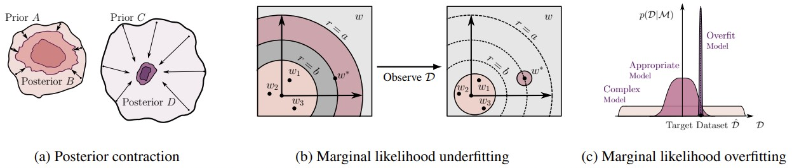
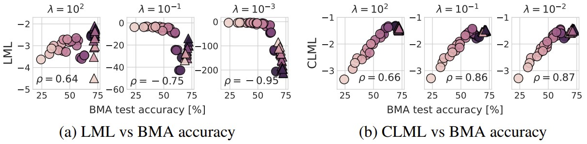
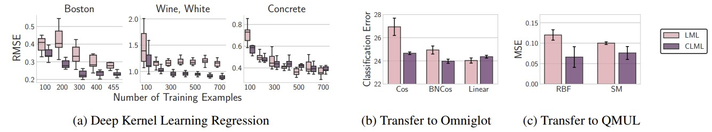

# Bayesian Model Selection, the Marginal Likelihood, and Generalization


This repository contains experiments of the group student project for the Bayesian Machine Learning class of the MVA master 2023-2024. 

Authors:
- Basile Terver
- Léa Khalil
- Jean Dimier

We study the paper [_Bayesian Model Selection, the Marginal Likelihood, and Generalization_](https://arxiv.org/abs/2202.11678) by [Sanae Lotfi](https://sanaelotfi.github.io/), [Pavel Izmailov](https://izmailovpavel.github.io/), [Gregory Benton](g-benton.github.io), [Micah Goldblum](https://goldblum.github.io/), and [Andrew Gordon Wilson](https://cims.nyu.edu/~andrewgw/), reproduce and extend some of their experiments to other datasets.


## Introduction

In this paper, the authors discuss the marginal likelihood as a model comparison tool, and fundamentally re-evaluate whether it is the right metric for predicting generalization of trained models, and learning parameters.
- They discuss the strengths and weaknesses of the marginal likelihood for model selection, hypothesis testing, architecture search and hyperparameter tuning. 
- They show that the marginal likelihood is answering an entirely different question than the generalization question: "how well will my model generalize on unseen data?", which makes the difference between hypothesis testing and predicting generalization.
- They show that optimizing the marginal likelihood can lead to overfitting and underfitting in the function space. 
- They revisit the connection between the marginal likelihood and the training efficiency, and show that models that train faster don't necessarily generalize better or have higher marginal likelihood. 
- They demonstrate how the Laplace approximation of the marginal likelihood can fail in architecture search and hyperparameter tuning of deep neural networks. 
- They study the conditional marginal likelihood and show that it provides a compelling alternative to the marginal likelihood for neural architecture comparison, deep kernel hyperparameter learning, and transfer learning. 



In this repository we provide code for reproducing results in the paper.

## Requirements

We use the [Laplace](https://github.com/AlexImmer/Laplace) package for Laplace experiments, which requires `python3.8`. It can be installed using `pip` as follows:

```bash
pip install laplace-torch
```

# Experiments

You can reproduce the GP experiments by running the Jupyter notebooks in `./GP_experiments/`. 

## CIFAR-10 and CIFAR-100
Careful: for code simplicity, we have hardcoded our data path at the beginning of all the scripts as data_directory = `"/Data/basile-terver/__data__"` but one should adapt this path to store heavy dataset files in a relevant location.

To train ResNet and CNN models and compute their Laplace marginal likelihood for CIFAR-10 and CIFAR-100 as in section 6 of the paper, navigate to `./Laplace_experiments/cifar` and run the following: 
```bash
python logml_<dataset>_<models>.py --decay=<weight decay parameter> \
				 --prior_structure=<the structure of the prior: scalar or layerwise> \
                 --hessian_structure=<structure of the hessian approximation: full, kron, diag> \
                 --base_lr=<optimization learning rate> \
                 --use_sgdr=<use cosine lr scheduler> \
                 --optimizehypers=<optimize hyperparameters using Laplace approximation> \
                 --hypers_lr=<learning rate for hyperparameter learning> \
                 --batchnorm=<use batchnorm instead of fixup> \
                 --chk_path=<path to save the checkpoints> \
                 --result_folder=<path to save the results> 
```
We have set the default values of the flags of these 4 scripts so that you can simply run python logml_<dataset>_<models>.py to train on the full dataset. 

Then, you can rerun those scripts only on 80% of the train set by modifying inside the script the trainset and testset, and setting --chk_path="checkpoint/cifar10/subset/cnns" for cnns and --chk_path="checkpoint/cifar10/subset/resnets" for resnets.

Remark: we have trained all these models on a NVIDIA RTX A5000 with 24GB of GPU RAM. Training so many models for 250 epochs each takes about a day.

Then, once we have trained (with all or with 80% of the data) all our models, we can compute the conditional marginal likelihood, MAP Test Accuracy, BMA Test Accuracy, MAP Test Log-Likelihood and BMA Test Log-Likelihood as follows:

```bash
python logcml_<dataset>_<models>.py --prior_prec_init=<weight decay parameter> \
				 --prior_structure=<the structure of the prior: scalar or layerwise> \
                 --hessian_structure=<structure of the hessian approximation: full, kron, diag> \
                 --base_lr=<optimization learning rate> \
                 --bma_nsamples=<number of posterior samples to average over> \
                 --data_ratio=<ratio of the data to condition on> \
                 --max_iters=<number of iterations to optimize the rescaling parameter of the hessian> \
                 --partialtrain_chk_path=<path to checkpoints of models trained on a fraction of the data> \
                 --fulltrain_chk_path=<path to checkpoints of models trained on the full data> \
                 --result_folder=<path to save the results> 
```

Remark: We had to create `./Laplace_experiments/cifar/data/cifar100_subsets.npz` by ourselves as it was missing in the repository of the authors, as well as fixing other bugs in the code.

Remark: Running those scripts takes a comparable amount of time to the proper training with the logml_<dataset>_<models>.py scripts as it is not parallelizable and mostly makes use of CPUs.

Once you have run all these scripts, you can reproduce the plots of the original paper by running the `Laplace_experiments/plot_neural_arch_search.ipynb` notebook, where the last plot is to compared with the plots of Appendix H of the original paper. We have only shown the results for CIFAR10 but the exact same functions can be used for CIFAR100 results by just adapting the files paths. 

Remarks: the authors of the original paper and repo did not provide the code to reproduce their plots from Appendix H, we provide such code with this notebook. We did not have time to train resnets for other decay/prior values than $\lambda=100$. Finally, we push our model checkpoints and LML and CLML results to our repository to save the user costly training.

The below figure from the original paper is a summary of all the figures of Appendix H:



## Gaussian process kernel learning

We mainly played with the jupyter notebook located in `./GP_experiments/marginal_lik_gps_rq copy.ipynb', presenting a fitting of a gaussian process defined by a Rationale-Quadratic kernel. The main ideas are to change the parameters $\texttt{true\_lengthscale}$ and $\texttt{true\_noise}$ and the boolean $\texttt{overestimate}$, which triggers the main change in the behavior of the LML vs the test likelihood. 

## Deep kernel learning 

To reproduce results for the deep kernel learning experiments, navigate to `./DKL_experiments/` and run the following:

```bash
python exact_runner.py --m=<the number of datapoints on which we condition> \
				 --losstype=<type of the loss> \
                 --dataset=<choice of the dataset> \
                 --ntrain=<number of training points> \
                 --ntrial=<number of trials > 
```



